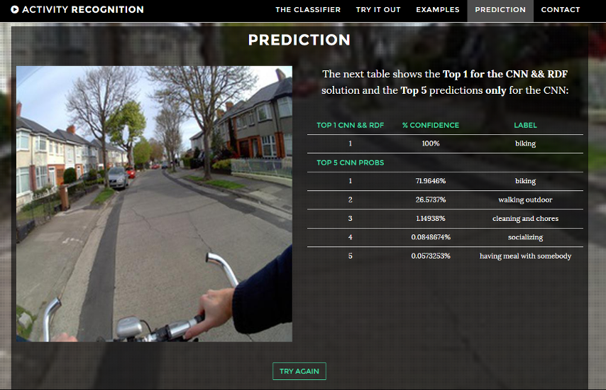

## Small project based on an activity classifier

This project is done with Flask and uses Caffe and trained networks in the background.

### Data

The networks, datasets and a deeper explanation can be found in [Daily Activity Recognition](https://github.com/hermetico/TFG)
